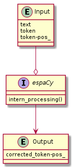

# espaCy
- [Documentación en Español](##Español)
- [English Documentation](##English)

## Español
- Es una librería que se encarga de corregir y ampliar las funciones de analizador sintáctico de spaCy para textos en español.
- Entre sus características principales se encuentran:
    - Aumentar la fiabilidad del análisis de spaCy en un 20%
    - Añadir los siguientes tipos de palabras:
        - Afijos: `AFJ`
        - Artículos: `ART`
        - Cuantificadores: `CUAN`
        - Demostrativos: `DEM`
        - Extranjerismos: `EXT`
        - Interrogativos: `INTR`
        - Posesivos: `POS`
        - Relativos: `REL`  
    - Contar con la fiabilidad de una Institución como la **RAE (Real Academia de la Lengua Española)** 

### Instalación
- Descarga este repositorio e instala las dependencias necesarias:

```
git clone <URL>
cd espaCy
pip3 install -r requirements.txt
sudo bash requirements_2.sh
```

### Funcionamiento


- Al programa se le deben de proporcionar:
    - La palabra cuya etiqueta se desee corregir
    - La etiqueta que spaCy ha extraido de esa palabra
    - La frase en la que aparece la palabra  
- El programa devuelve:
    - La etiqueta corregida  

### Utilízalo en tu Proyecto
- Añade este repositorio a tu proyecto e importa la función principal:

**tu_proyecto.py**
```
from espaCy.espaCy import espacy

if __name__ == '__main__':
    print('espaCy Test')
    print('\nTesting parameters')
    print('\tword:' + str(word))
    print('\tword_pos:' + str(word_pos))
    print('\tphrase:' + str(phrase))
    corrected_word_pos = espacy(word, word_pos, phrase)
    print('\nOutput: ' + str(corrected_word_pos))
```

## English
- espaCy is a library that is able to correct and expanding the parser functions of spaCy for texts in Spanish.
- Main Features:
    - Increase the reliability of spaCy analysis by 20%
    - Add the following types of words:
        - Affixes: `AFJ`
        - Articles: `ART`
        - Quantifiers: `QUAN`
        - Demonstratives: `DEM`
        - Foreign words: `EXT`
        - Interrogatives: `INTR`
        - Possessives: `POS`
        - Relatives: `REL`
    - Have the reliability of an Institution such as the **RAE (Real Academia de la Lengua Española)**

### Installation
- Download this repository and install the necessary dependencies:

```
git clone <URL>
cd espaCy
pip3 install -r requirements.txt
sudo bash requirements_2.sh
```

### Usage


- The program must be provided with:
    - The word whose tag you want to correct
    - The label that spaCy has extracted from that word
    - The sentence in which the word appears
- The program returns:
    - The label corrected

### Use it in your Project
- Add this repository to your project and import the main function:

**your_project.py** 
```
from espaCy.espaCy import espacy

if __name__ == '__main__':
    print('espaCy Test')
    print('\nTesting parameters')
    print('\tword:' + str(word))
    print('\tword_pos:' + str(word_pos))
    print('\tphrase:' + str(phrase))
    corrected_word_pos = espacy(word, word_pos, phrase)
    print('\nOutput: ' + str(corrected_word_pos))
```
